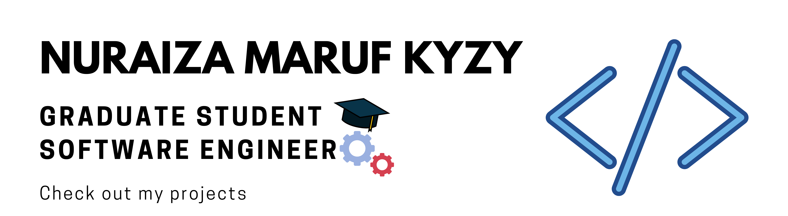

### Hi there 👋
 

<!--
**nuraiza/nuraiza** is a ✨ _special_ ✨ repository because its `README.md` (this file) appears on your GitHub profile.

Here are some ideas to get you started: -->
**About me** 	:information_desk_person::
I am Nuraiza from Kyrgyzstan, currently living in Warsaw, Poland. I am studying last semester at the Polish-Japanese Academy of Information Technology, my field of study is - Computer Science. At the moment I am actively looking for software engineer job position to gain experience and start my career path.

**Technologies&Tools** :hammer_and_pick:

 	         	  

 

**More info** :speech_balloon::
  - :video_game: I am currently working as a Functional Video Games Tester in Testroniclabs 	
   - :gear: I am currently working on my diploma project - 3D open world game with procedurally generated environment in Unity 
   -	:seedling: I am currently learning Android development, Kotlin
   - :necktie: I am looking for opportunities to try my skills in professional IT environment 

- 📫 How to reach me: 
 <a href="<https://www.linkedin.com/in/nuraiza/>"></a>

